# Roleplay Chat

A Minecraft Fabric mod (1.21.6) for roleplay servers. It replaces the vanilla chat with a proximity-based system, assigns each player an anonymous hex code identity, and gives them an RP name visible only to players they've been introduced to.

---

## Proximity Chat

Every chat message is delivered only to players within a configured range. The range depends on the type of message, triggered by a prefix character or a slash command.

| Type | Color | Range | Prefix | Command |
|------|-------|-------|--------|---------|
| Whisper | 🟪 Violet `#CC33CC` | 4 blocks | `«` or `"` | `/whisper <message>` |
| Action | 🟩 Green `#33CC33` | 25 blocks | `*` | `/action <message>` |
| Roll | 🟩 Green `#33CC33` | 25 blocks | — | `/roll [notation]` |
| Speak | ⬜ White `#FFFFFF` | 30 blocks | _(default)_ | `/speak <message>` |
| OOC | 🩶 Gray `#AEC1D5` | 60 blocks | `(` | `/ooc <message>` |
| Shout | 🟥 Red `#CC3300` | 80 blocks | `!` | `/shout <message>` |
| Global OOC | 🩶 Gray `#AEC1D5` | Unlimited | `[` | `/globalOoc <message>` |
| Support | 🩷 Pink `#FF99CC` | Unlimited | `?` | `/support <message>` |

> **Support** messages are only visible to server operators (permission level ≥ 2) and the sender.

Colors, ranges, and prefix characters are all configurable — see [Configuration](#configuration-server-admins).

### Color fade with distance

Messages fade toward black as the receiver moves away from the sender, reaching full black at maximum range. Players outside range receive nothing.

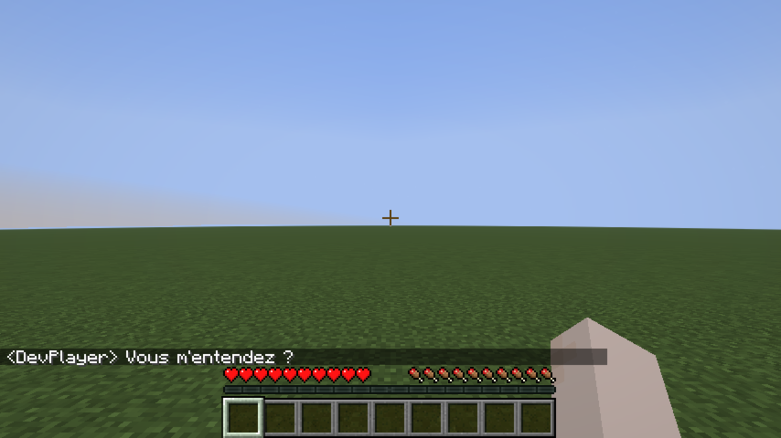

### Chat message examples

<table>
<tr>
  <td align="center">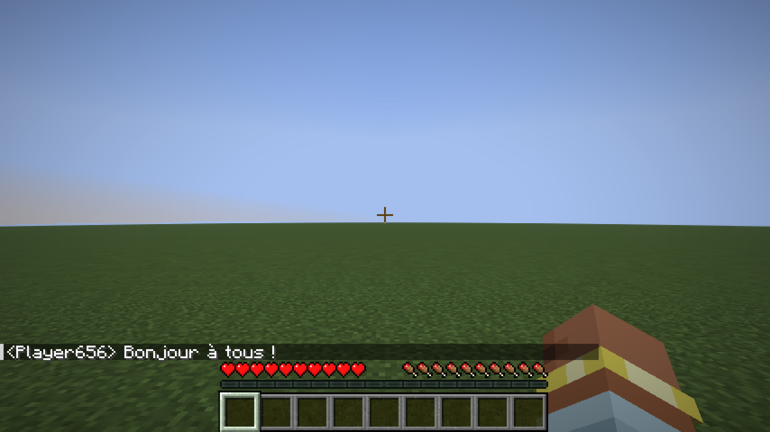<br><sub>Speak</sub></td>
  <td align="center">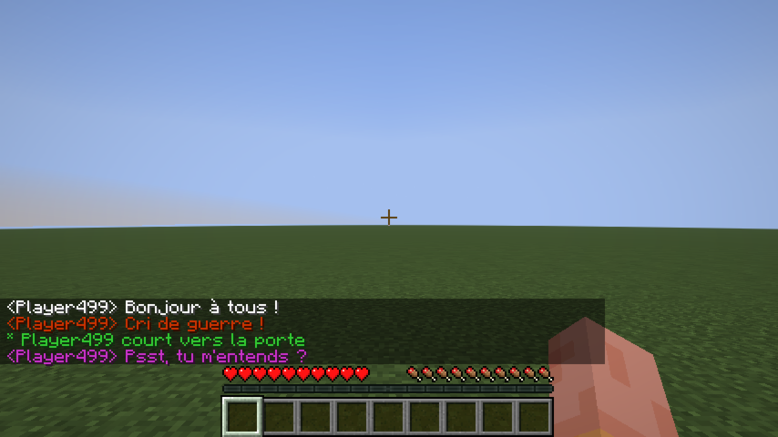<br><sub>Whisper</sub></td>
  <td align="center">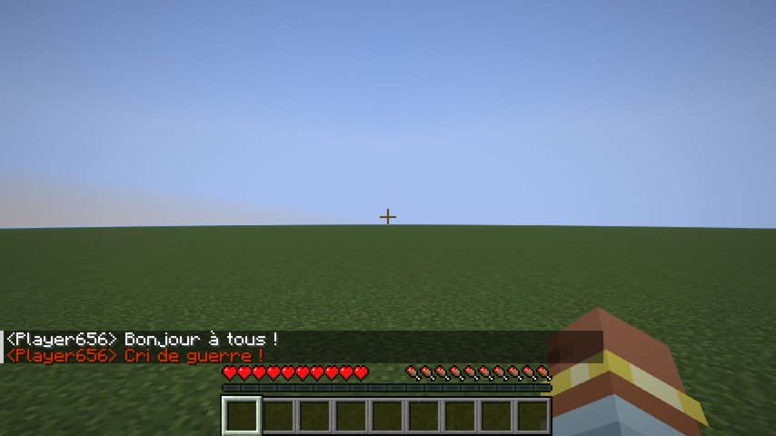<br><sub>Shout</sub></td>
</tr>
<tr>
  <td align="center">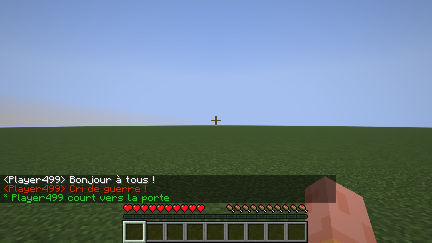<br><sub>Action</sub></td>
  <td align="center">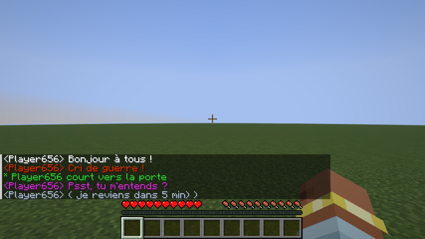<br><sub>OOC</sub></td>
  <td align="center">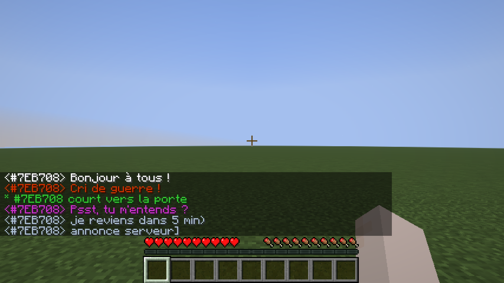<br><sub>Global OOC</sub></td>
</tr>
</table>

### Dice Roll

`/roll` broadcasts a dice result to nearby players (same range as Action, 25 blocks by default).

**Syntax:** `/roll [NdF[±bonus]]`

| Example | Meaning |
|---------|---------|
| `/roll` | Rolls 1d20 (default) |
| `/roll d6` | Rolls 1d6 |
| `/roll 1d20+3` | Rolls 1d20, adds 3 |
| `/roll d8-1` | Rolls 1d8, subtracts 1 |

```
* Alice [1d20+3] → 17  (14+3)
* Bob [1d6] → 4  (Critical Failure)
```

Rolling the maximum value shows **(Critical Success)** in bold; rolling 1 shows **(Critical Failure)** in bold.

---

## RP Identity System

### Anonymous hex code

Every player is assigned a unique 6-digit hex code at their first connection (e.g. `#15AACF`). This code:

- Appears on their nametag (gray italic, below their RP name).
- Replaces their Minecraft username in chat until they have an RP name.
- Shows as a hover tooltip on their name in chat once they have an RP name.
- Works as a target in **all vanilla commands** (`/kick`, `/ban`, `/op`, `/tp`, `/give`, `/kill`, `/damage`, …) — type `#` and autocomplete will suggest codes.

### RP name

On first connection, players are shown a screen to choose their RP name:

<table>
<tr>
  <td align="center">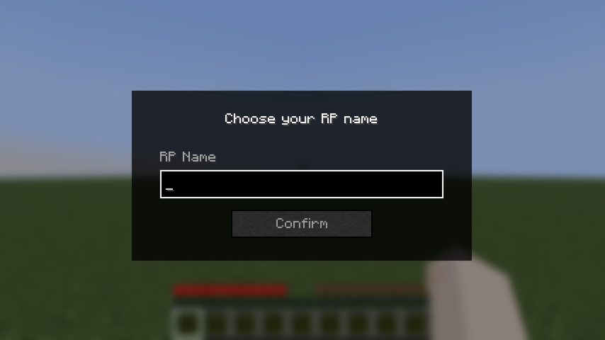<br><sub>Name input</sub></td>
  <td align="center">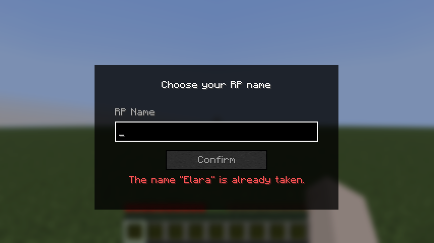<br><sub>Validation error</sub></td>
</tr>
</table>

The screen cannot be bypassed with Escape — pressing Escape opens the pause menu, and the screen reappears when the player returns to the game.

Rules:
- Must be non-empty.
- Must be 32 characters or fewer.
- Must be unique (case-insensitive).

Once set, the RP name can be changed at any time with `/rpname <name>`.

### RP name chat example

Once a player has an RP name, it appears in chat instead of their hex code:

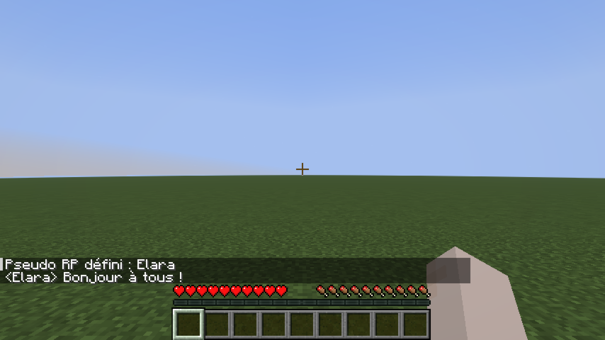

---

## Nametag Visibility

### Introduction system

By default, other players' RP names are hidden — their nametag shows `?`. To reveal your identity to a specific player:

```
/rp present #15AACF
```

This sends a notification to that player and permanently records the introduction. After a reconnect, introductions are restored automatically.

### Nametag states

<table>
<tr>
  <td align="center">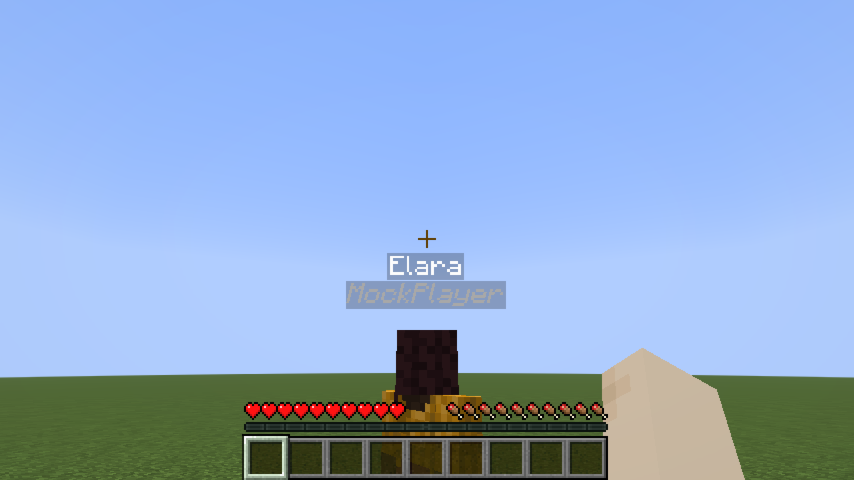<br><sub>Known player</sub></td>
  <td align="center">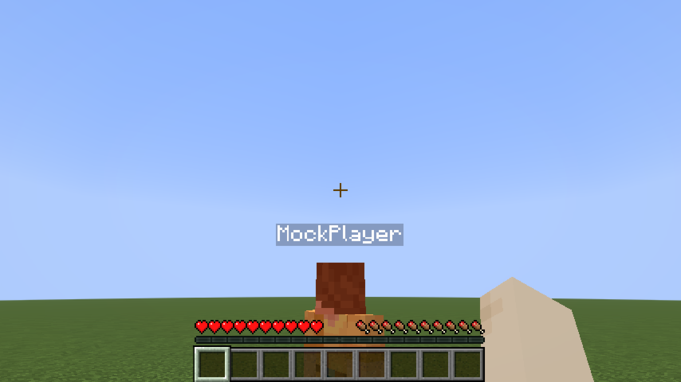<br><sub>Not yet introduced</sub></td>
  <td align="center">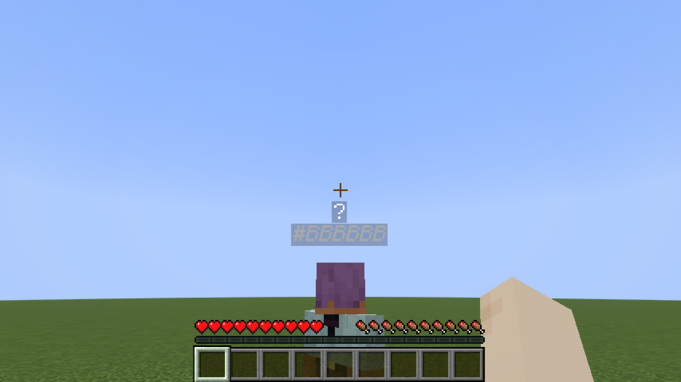<br><sub>No RP name yet</sub></td>
</tr>
</table>

### Line-of-sight occlusion

RP names are not visible through walls. If a solid block stands between your camera and another player, their entire nametag disappears — even if they have introduced themselves to you. Creative mode bypasses this check.

<table>
<tr>
  <td align="center">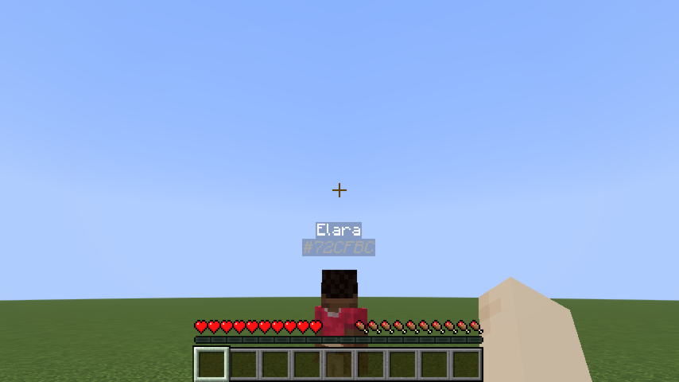<br><sub>Clear line of sight</sub></td>
  <td align="center">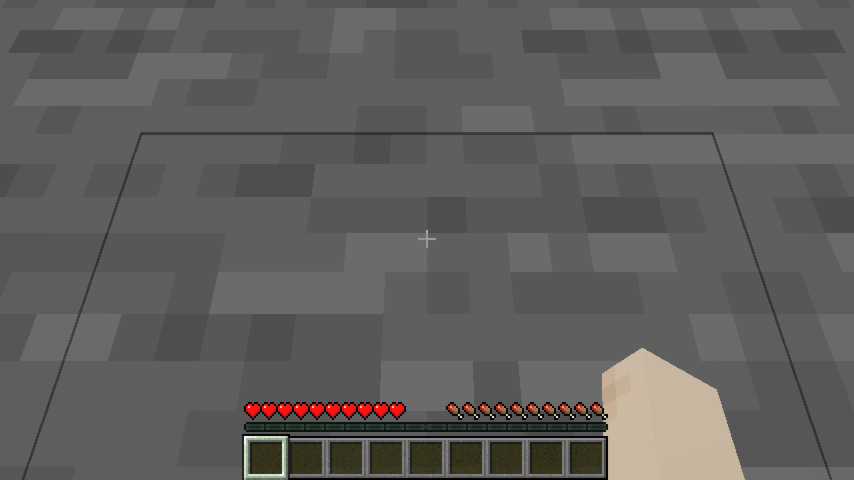<br><sub>Wall between players</sub></td>
  <td align="center">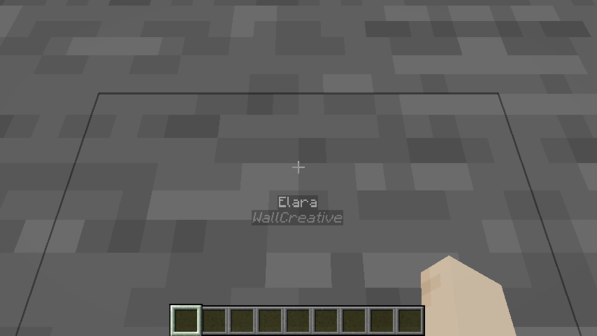<br><sub>Creative mode — wall ignored</sub></td>
</tr>
</table>

### Identity-concealing headgear

A player wearing an item tagged `roleplay-chat:conceals_identity` in the helmet slot appears as `?` to everyone — even players they've introduced themselves to. Their hex code remains visible so staff can still identify them.

<table>
<tr>
  <td align="center">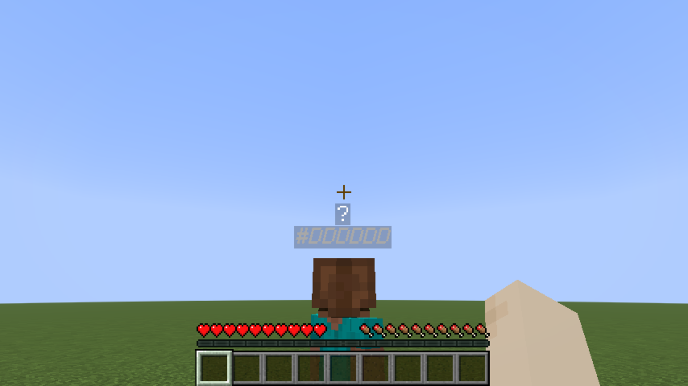<br><sub>Concealing helmet worn</sub></td>
  <td align="center">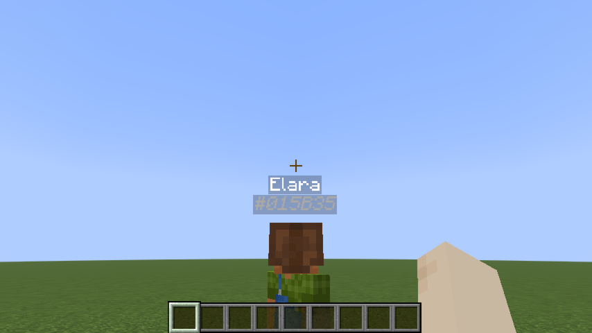<br><sub>Creative mode — concealment ignored</sub></td>
</tr>
</table>

The mod ships with `minecraft:leather_helmet` in this tag by default. To add more items, create a datapack file:

**`data/roleplay-chat/tags/items/conceals_identity.json`**
```json
{
  "replace": false,
  "values": [
    "minecraft:leather_helmet",
    "yourmod:hood",
    "yourmod:balaclava"
  ]
}
```

> `"replace": false` merges your list with the mod's defaults instead of replacing them.

---

## Configuration (server admins)

Settings live in **`config/roleplay-chat.json`** (next to your server or `.minecraft` folder). The file is created with defaults on first run. Edit it as **UTF-8** to preserve special prefix characters (e.g. `«`).

Each message type has three fields:

| Field | Meaning |
|-------|---------|
| `radius` | Range in blocks. `0` = unlimited (delivered to all online players). |
| `color` | RGB color as a decimal integer (`16777215`) or hex string (`"#FFFFFF"`). |
| `characters` | Prefix strings that trigger this type. `speak` uses `[]` (no prefix). |

**Reload without restart:** `/roleplaychat reload` (operator level 4) re-reads the file while the server is running. If the file is invalid, the current settings are kept and an error is logged.

**Supported keys:** `speak`, `whisper`, `shout`, `action`, `ooc`, `globalOoc`, `support`, `roll`.

**Example (excerpt):**
```json
{
  "speak": {
    "radius": 30,
    "color": 16777215,
    "characters": []
  },
  "whisper": {
    "radius": 4,
    "color": "#CC33CC",
    "characters": ["«", "\""]
  },
  "shout": {
    "radius": 80,
    "color": 13369344,
    "characters": ["!"]
  }
}
```
